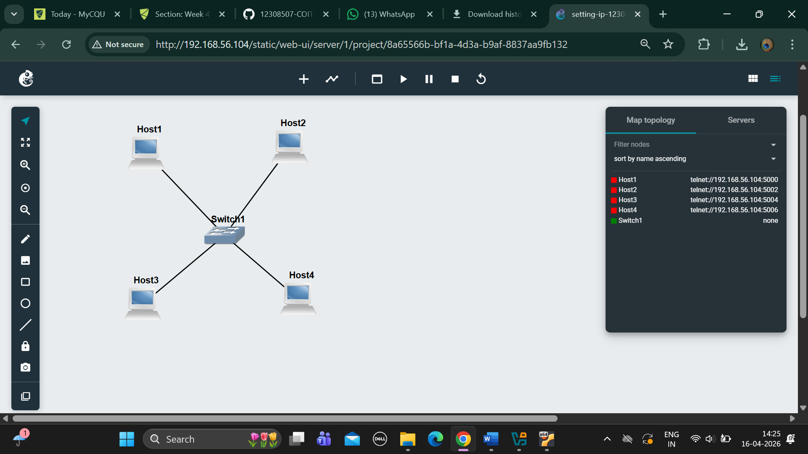

# WEEK2 #

1.	Exported project:-

   
2.	Screenshot of the network:-

  
3.	Screenshot of the console of each of the four hosts showing the IP addresses from ip address show:-
- HOST 1

- HOST 2

- HOST 3

- HOST 4

