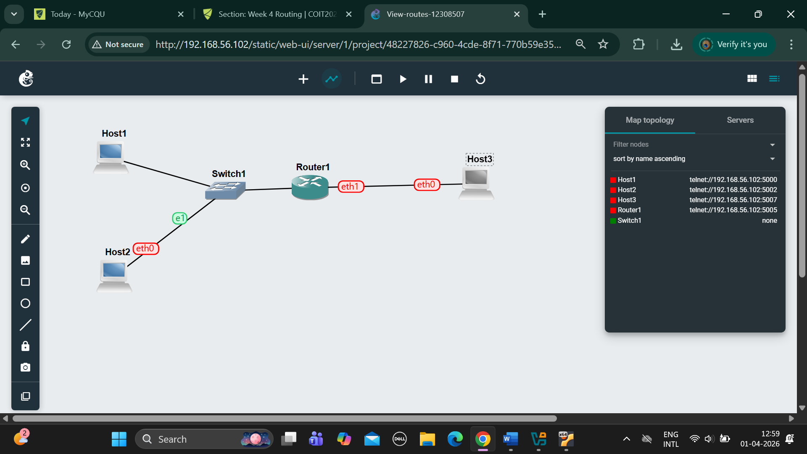
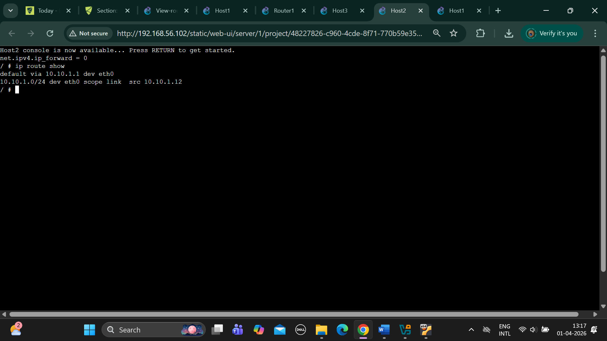
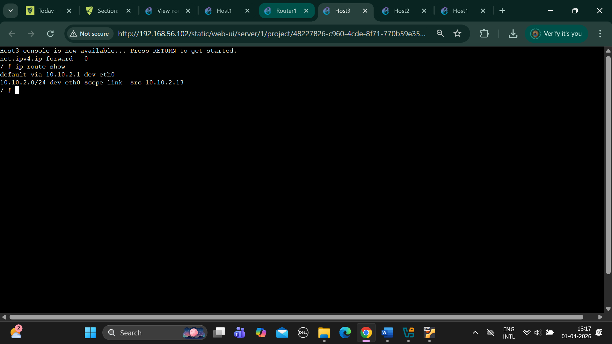
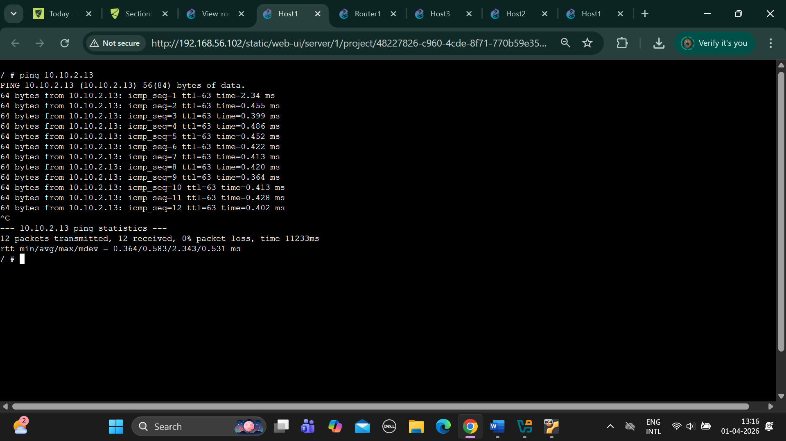
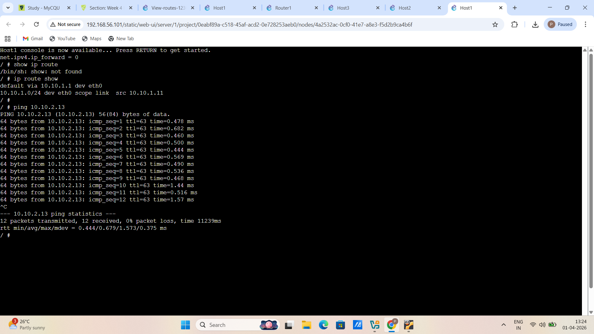

# Outputs:-

1. Exported project

2. Screenshot of the network

3. Record of the IP addresses and routing tables of each host and router.

4.Screenshot of a successful ping from a host one one subnet to a host on the other subnet.

- TASK 2

1.	Exported project

  
  
2.	Screenshot of the network

  ![network]
  
3.	Output  showing neigbour routers of FRR1

)

	  
4.	Output showing routing table for two routers.

.png)

