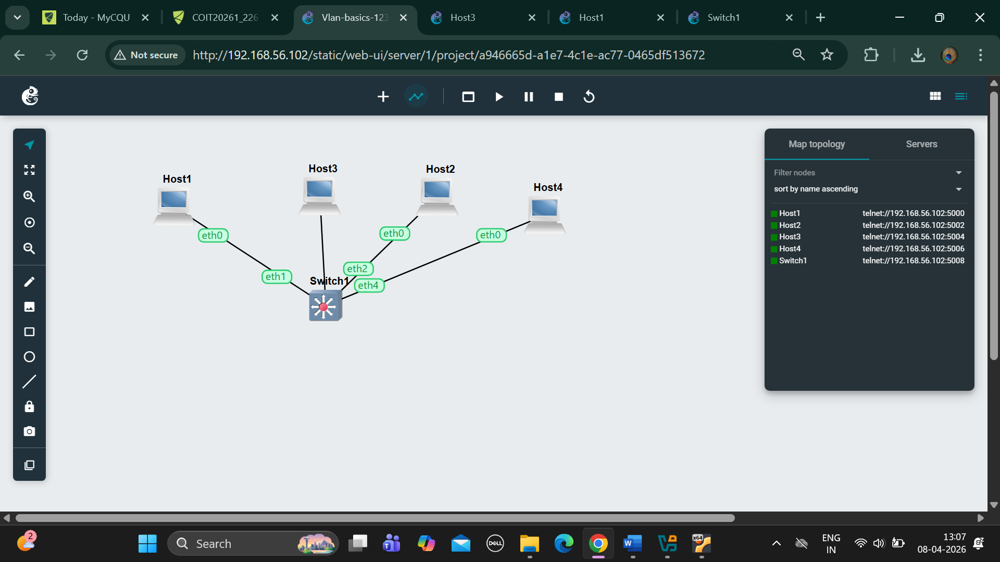
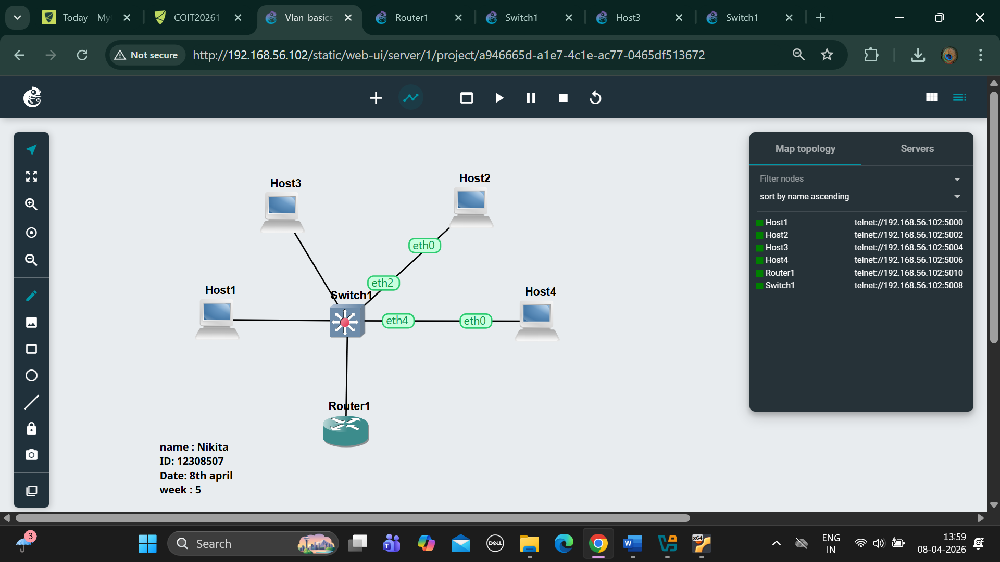

# WEEK5

- TASK 1

1.	Exported project:-

2.	Screenshot of the network:-

   
  
3.	Screenshot showing the ports and tags on the switch:-

- TASK 2

1.	Exported project

2.	Screenshot of the network

3.	Screenshot showing the ports and tags on the switch 

